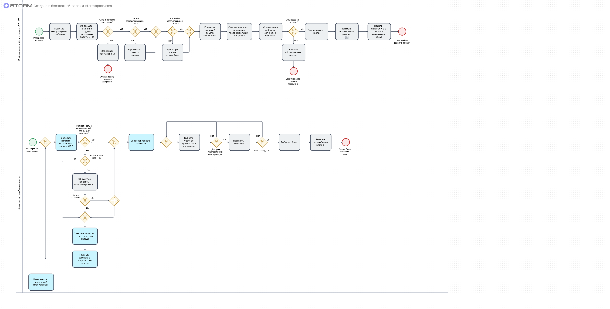
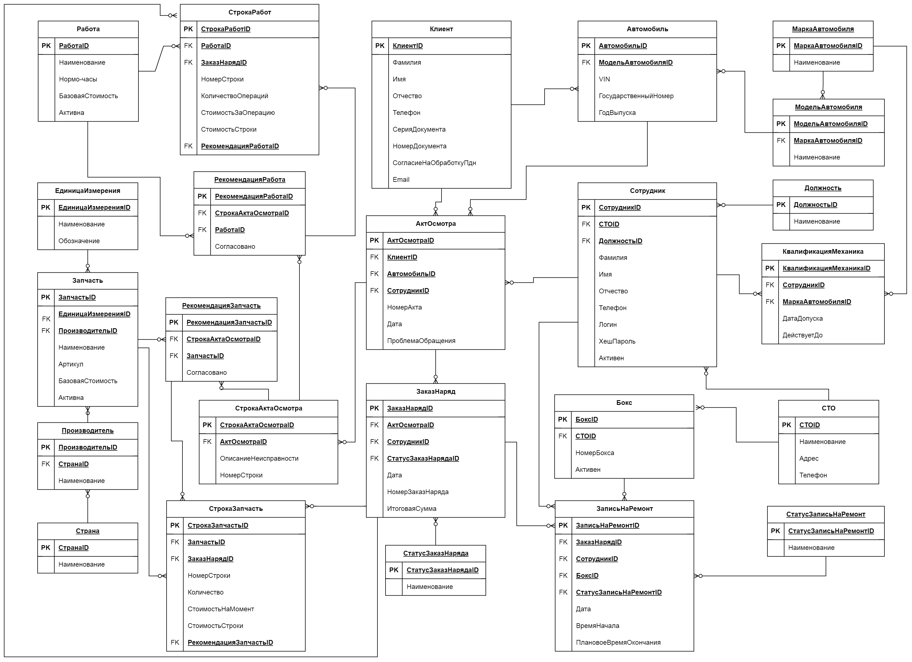
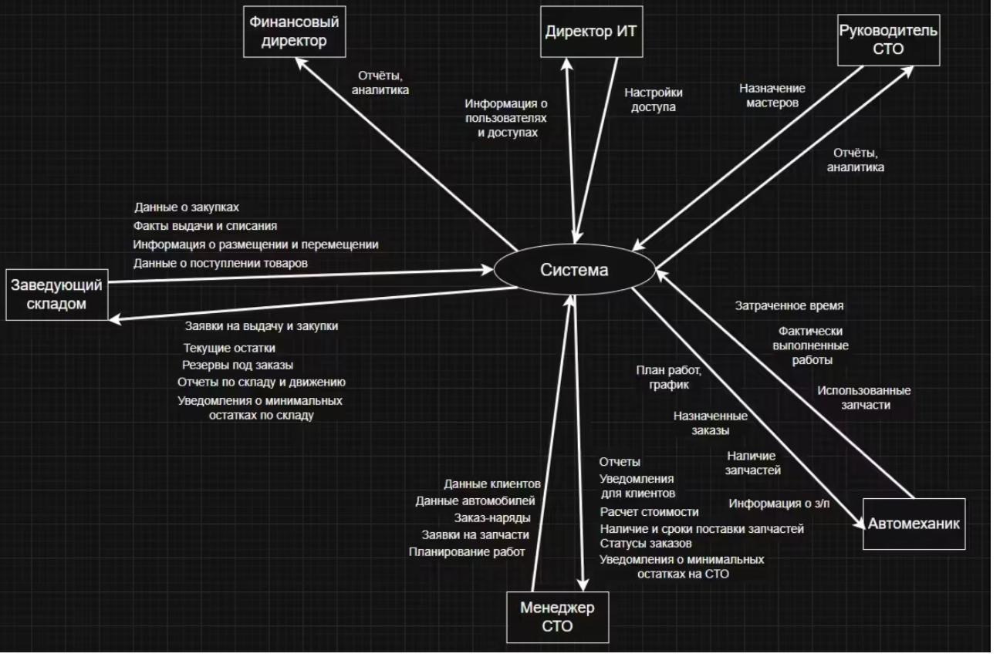
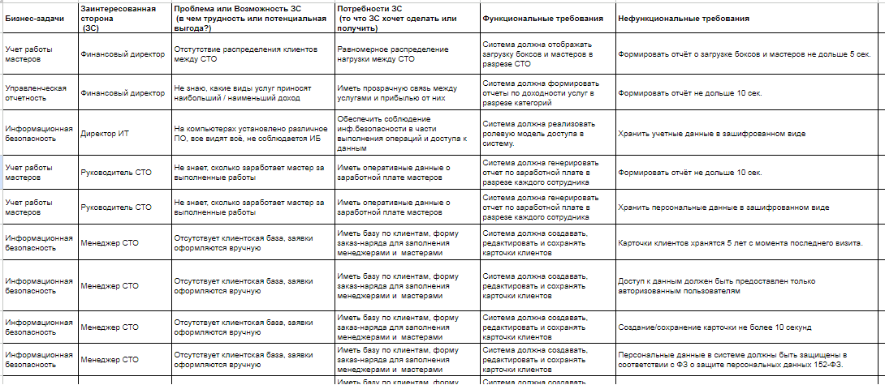

# Алина Ханипова — системный аналитик

Проектирую информационные системы от бизнес-целей до постановок задач
в разработку: требования, BPMN 2.0, UML, ER-модель, Use Case, User Story, проектирование API,
тест-кейсы.

Контакты: [Telegram](https://t.me/alina_khanipova)

---

## Проект: ИС для сети СТО (приёмка автомобиля)
*Выпускной проект курса OTUS «Системный аналитик. Basic»*

**Задача:** спроектировать информационную систему для процесса приёмки
автомобиля в сети станций техобслуживания.

**Что сделано:**
- Интервью со стейкхолдерами, 15+ выявленных потребностей
- Таблица трассировки: бизнес-задача → потребность → ФТ/НФТ
- Процесс приёмки в BPMN 2.0
- 
- ER-модель и словарь данных
- 
- Use Case по Коберну, границы MVP и первого релиза
- 11 постановок задач: карты диалогов, макеты экранных форм, DoD
- Тест-кейсы для задач MVP

**Проектные решения:** идентификация по VIN, фиксация цен на момент
заказ-наряда, защита ПДн по 152-ФЗ.

[Проект на Google Диске](https://drive.google.com/drive/folders/1Vdy7hEtQJzBJmo68_isr5o5fpn0Ydqe9?usp=drive_link)

---

## Дополнительные проектные работы
*Практические работы курса OTUS «Системный аналитик. Basic»*

### Выявление и формализация требований

**Задача:** для сети автомастерских, вводящей централизованный учёт работ,
запчастей и трудозатрат, — определить заинтересованные стороны, выбрать
методы выявления требований и довести их до трассируемых ФТ и НФТ.

**Что сделала:**
- Определила 14 заинтересованных сторон и подобрала метод выявления
  под каждую: интервью для руководителей, наблюдение за работой
  для исполнителей, анкетирование для клиентов, анализ документации
  для внешних сторон и регуляторов
- Составила вопросы для интервью и анкету для клиентов
- Формализовала проблемы и потребности заинтересованных сторон
- Построила контекстную диаграмму: границы системы и информационные
  потоки с внешними ролями
- Свела матрицу трассировки: бизнес-задача → ЗС → проблема →
  потребность → функциональные и нефункциональные требования.

**Что оказалось неочевидным:**
- Потребность заинтересованной стороны легко подменить готовым решением.
  Сначала формулировала потребности сразу как требования к системе —
  это сужает пространство решений ещё до анализа.
- Граница между ФТ и НФТ на практике тоньше, чем в определении.
  Ориентир, который сработал: ФТ отвечает на «что система делает»,
  НФТ — «насколько хорошо» (время отклика, шифрование, срок хранения).
- Открытые вопросы, хорошие для интервью, не работают в анкете:
  анкету переписала на закрытые и шкальные.
- Метод выявления должен соответствовать стадии проекта. Для
  тестировщика изначально указала анализ отчётов о дефектах — на этапе
  требований к ещё не существующей системе их нет.

### Анализ и доработка Use Case процесса заказ-наряда
Поиск логических ошибок в готовых спецификациях, корректировка сценариев,
постановки задач в разработку, тест-кейсы, отчёты о дефектах.

### Проектирование интеграционного взаимодействия
Исследование внешнего API, sequence-диаграмма обмена.

### Выявление требований (групповая работа)
Подготовка и проведение интервью со стейкхолдерами, формализация результатов.

### UML-моделирование
Перевод ER-модели в диаграмму классов, Activity-диаграммы.
