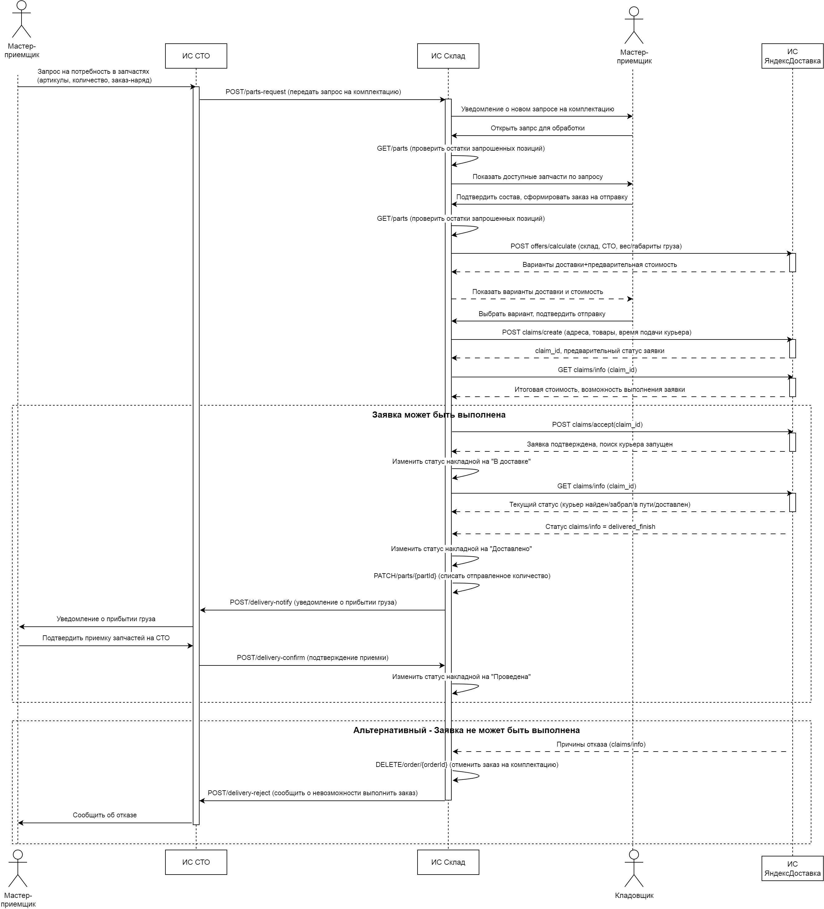

# Алина Ханипова — системный аналитик

Проектирую информационные системы от бизнес-целей до постановок задач
в разработку: требования, BPMN 2.0, UML, ER-модель, Use Case, User Story, проектирование API,
тест-кейсы.

Контакты: [Telegram](https://t.me/alina_khanipova)

---

## Проект: ИС для сети СТО (приёмка автомобиля)
*Выпускной проект курса OTUS «Системный аналитик. Basic»*

**Задача:** спроектировать информационную систему для процесса приёмки
автомобиля в сети станций техобслуживания.

**Что сделано:**
- Интервью со стейкхолдерами, 15+ выявленных потребностей
- Таблица трассировки: бизнес-задача → потребность → ФТ/НФТ
- Процесс приёмки в BPMN 2.0
- 
- ER-модель и словарь данных
- 
- Use Case по Коберну, границы MVP и первого релиза
- 11 постановок задач: карты диалогов, макеты экранных форм, DoD
- Тест-кейсы для задач MVP

**Проектные решения:** идентификация по VIN, фиксация цен на момент
заказ-наряда, защита ПДн по 152-ФЗ.

[Проект на Google Диске](https://drive.google.com/drive/folders/1Vdy7hEtQJzBJmo68_isr5o5fpn0Ydqe9?usp=drive_link)

---

## Дополнительные проектные работы
*Практические работы курса OTUS «Системный аналитик. Basic»*

### Выявление и формализация требований

**Задача:** для сети автомастерских, вводящей централизованный учёт работ,
запчастей и трудозатрат, — определить заинтересованные стороны, выбрать
методы выявления требований и довести их до трассируемых ФТ и НФТ.

**Что сделала:**
- Определила 14 заинтересованных сторон и проранжировала их по влиянию на проект и важности для него.
- Подобрала метод выявления под каждую из ЗС: интервью для руководителей, наблюдение за работой
  для исполнителей, анкетирование для клиентов, анализ документации
  для внешних сторон и регуляторов
- Составила вопросы для интервью и анкету для клиентов
- Формализовала проблемы и потребности заинтересованных сторон
- Построила контекстную диаграмму: границы системы и информационные
  потоки с внешними ролями (роли были заданы преподавателем).
  
- Свела матрицу трассировки: бизнес-задача → ЗС → проблема →
  потребность → функциональные и нефункциональные требования.

[Полная матрица трассировки](https://otus.ru/redirect/?to=https%3A%2F%2Fdocs.google.com%2Fspreadsheets%2Fd%2F1Gp7DRPOUVvCo-iU7eJq_hjz_OgxQTxs7%2Fedit%3Fusp%3Dsharing%26ouid%3D110413924415500614045%26rtpof%3Dtrue%26sd%3Dtrue)

**Что оказалось неочевидным:**
- Потребность заинтересованной стороны легко подменить готовым решением.
  Сначала формулировала потребности сразу как требования к системе —
  это сужает пространство решений ещё до анализа.
- Граница между ФТ и НФТ на практике тоньше, чем в определении.
  Ориентир, который сработал: ФТ отвечает на «что система делает»,
  НФТ — «насколько хорошо» (время отклика, шифрование, срок хранения).
- Открытые вопросы, хорошие для интервью, не работают в анкете:
  анкету переписала на закрытые и шкальные.
- Метод выявления должен соответствовать стадии проекта. Для
  тестировщика изначально указала анализ отчётов о дефектах — на этапе
  требований к ещё не существующей системе их нет.

  ### Проектирование информационного взаимодействия

**Задача:** спроектировать процесс доставки запчастей с центрального склада
на СТО с привлечением внешнего логистического подрядчика — определить
границы систем, состав вызовов и передаваемых данных.

**Что сделала:**
- Определила границы трёх взаимодействующих систем (ИС СТО, ИС Склад,
  внешняя ИС логистики) и роли участников; ИС Склад назначена
  оркестратором процесса
- Изучила открытую документацию API Яндекс Доставки и отобрала методы
  под шаги процесса: расчёт стоимости до создания заявки, создание
  заявки, получение статуса, финальное подтверждение
- Спроектировала межсистемные вызовы ИС СТО ↔ ИС Склад
  (запрос запчастей, уведомление о доставке, подтверждение приёмки,
  отказ)
- Описала внутренний API учёта остатков склада: проверка наличия,
  получение состава заказа, списание после доставки, отмена заказа
- Построила диаграмму последовательности с альтернативными ветками
  «заявка выполнена» / «заявка не может быть выполнена»
- Обосновала каждый вызов: зачем он в этой точке процесса, какие данные
  передаются и что делает система с ответом

**Проектные решения:**
- Статусы исполнения запрашиваются циклически, так как API подрядчика
  не отправляет их сам
- Расчёт стоимости вынесен до создания заявки: этот вызов ни к чему
  не обязывает и позволяет показать варианты до фиксации заказа
- Списание со склада происходит только после подтверждения факта
  доставки, а не в момент отправки
- Ветка отказа обрабатывается явно: отмена заказа на складе
  и уведомление мастера-приёмщика

[Пояснения к диаграмме и описание вызовов](https://drive.google.com/file/d/1U9vZym5NEi39OrnYvX7Bqw2Xb5YnIaFa/view?usp=sharing)

### Анализ и доработка Use Case процесса заказ-наряда
Поиск логических ошибок в готовых спецификациях, корректировка сценариев,
постановки задач в разработку, тест-кейсы, отчёты о дефектах.

### Выявление требований (групповая работа)
Подготовка и проведение интервью со стейкхолдерами, формализация результатов.

### UML-моделирование
Перевод ER-модели в диаграмму классов, Activity-диаграммы.
